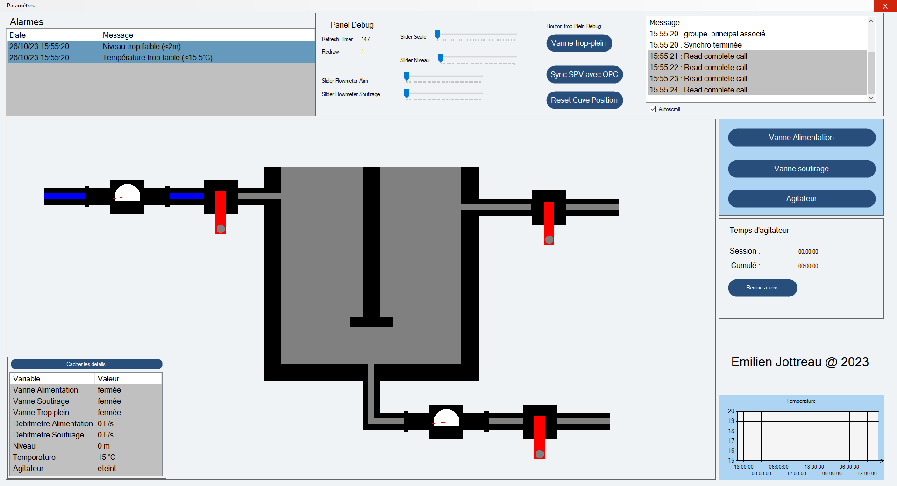
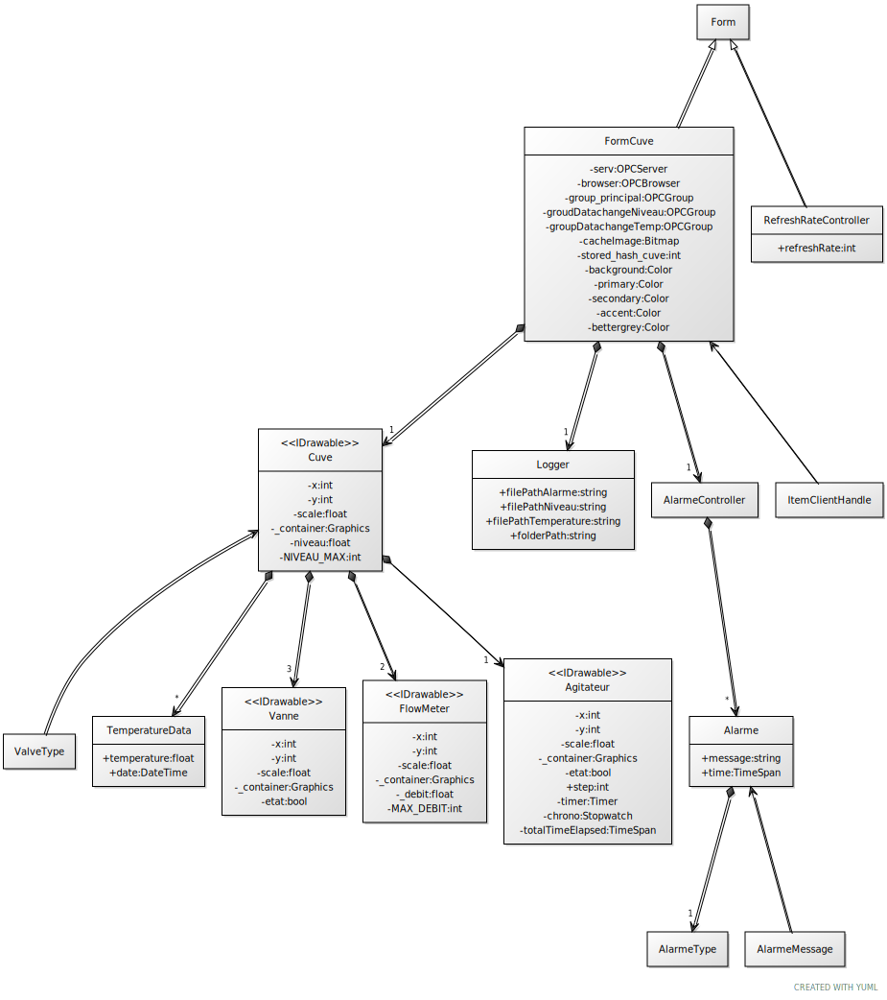

# Compte-rendu Supervision

Emilien Jottreau 2023

# 1- Présentation de l’interface

Voici à quoi ressemble l’interface, elle fonctionne sur des écrans 1920x1080, il n’est pas recommandé de la tester sur des écrans plus petits, sinon les panels se chevauchent.

Interface au démarrage

Elle est segmentée, je vais vous détailler l’utilisation de ces parties.

## 1-a. Alarmes

 En haut à gauche, on retrouve la zone pour afficher les alarmes. Elles sont datées et s’affichent de la plus récente a la plus ancienne. En bleu, on retrouve les alarmes actives, elle passent au gris lorsque l’alarme est résolue.

## 1-b. Debug

En haut à droite, on a un panel utile uniquement pour le debug de l’application. On retrouve des sliders pour tester le déplacement des aiguilles des débitmètres, changer le niveau d’eau …
Il y a aussi un bouton pour synchroniser toutes les variables avec l’OPC, par exemple lorsque l’on met des breakpoints pour debugger et que l’on manque un changement de valeur. Une listbox a droite répertorie tous les évènements, sur l’image ci dessus on voit des messages relatifs à la lecture de tag OPC. Il existe toute sorte de message, comme l’écriture d’un tag OPC, le changement de chemin de log, le changement de taux de rafraîchissement …
En production, il faudrait cacher ce panel, il ne sert qu’aux développeurs pour tester les fonctionnalités. On pourrait laisser la listbox pour la maintenance pour détecter des défauts.

## 1-c. Synoptique

Au centre gauche, on a une représentation de la cuve, avec les vannes, les débitmètres et l’agitateur. Tous ces éléments sont animés pour refléter l’état des variables.

Cuve avec un état diffèrent

On voit ici que les vannes n’ont plus la même position, le niveau d’eau est monté, les aiguilles de débitmètres ont bougé, l’agitateur tourne (il faut le voir en lançant la supervision, c’est une succession d’images qui donne l’impression qu’il tourne).

Pour changer l’état des vannes, l’utilisateur à la possibilité de cliquer sur la représentation graphique au niveau des vannes. 
Le graphique est déplaçable et redimensionnable, grâce au défilement de la souris ou d’un glisser-déplacer.

## 1-d. Détails

En bas à gauche, on voit la valeur des variable OPC affiché sous forme de tableau. Il possède un bouton pour le cacher, lorsqu’il est cliqué le tableau descends en dehors de la fenêtre et laisse apparaître un bouton pour l’afficher.

## 1-e. Commandes

Sur la droite, on retrouve 3 boutons pour interagir avec les vannes et l’agitateur. Le temps d’allumage de l’agitateur ainsi que le temps cumulé sont affichés. le temps total peut être remis a zéro.

## 1-f. Graphique

En bas à droite, on retrouve un graphique de l’évolution de la température en fonction du temps. Malheureusement, avec le simulateur, la température n’évolue pas beaucoup avec la “deadband” qu’on a mis (détaillé par la suite) on ne voit rien apparaitre. Pour voir cette fonctionnalité, il faut mettre le simulateur en pause, et changer la valeur de la température a la main.

## 1-g. Menu paramètre

Dans le menu paramètre tout en haut, on peut sélectionner le dossier pour récupérer les fichiers log. On peut aussi changer le taux de rafraîchissement de l’affichage

Menu paramètre

Pour changer la destination des fichiers log, j’utilise une fonction intégrée de .NET qui est “FolderBrowserDialog”, il permet de naviguer dans les dossiers de l’ordinateur et de renvoyer le dossier choisi

Fenêtre de navigation dans les fichiers

On retrouve ensuite la fenêtre de changement de taux de rafraîchissement, cela affecte la partie synoptique, le tableau détail et le rafraîchissement de temps affichés pour l’agitateur et l’ajout de valeurs sur le graphique température.

Fenêtre changement taux de rafraîchissement

# 2- Configuration serveur OPC

Dans le cadre de notre projet, nous utilisons KEPServeur. Il faut configurer l’espace d’adressage des variables OPC. Il faut charger le fichier “EspaceAdressageBassinEmilien.opf” dans KEPServer.

Au niveau de la configuration de KEPServeur, je vais détaillé ce qui a été fait. J’ai précisé sur la variable “niveau” et “temperature” les bornes maximales et minimales. Dans l’énoncé, il est précisé que, les valeurs de niveau vont de 0 à 4 mètres, les valeurs de température vont de 15 a 20 °C. Voici comment les paramétrer :

Configuration Scalling des deux variables

J’ai fait des tests et cela fonctionne comme prévu

# 3- Explication Technique

J’ai décidé d’organiser mon code avec des classes, voici le diagramme UML pour comprendre la structure de mon code. On ne voit pas les fonctions car je trouve cela plus lisible

## 3-a. Forms

Comme indiqué précédemment, j’ai deux form, le premier est principal, c’est celui qui est affiché au lancement de l’application. Le deuxième sert a gérer le taux de rafraichissement, il n’est pas très important, mais il se trouve dans le fichier RefreshRateControllerForm.cs.

## 3-b. Timers

Dans cette application, j’ai 3 timers.

1. timerUIRefresh, l’intervalle de temps entre deux activations est configurables grâce aux deuxième form. À chaque activation, il met a jour l’interface *(ligne 548 de FormCuve.cs)* 
    - Redessine le dessine si un élément a changé de valeur (position, échelle, état …).
    - Met à jour les chronomètre de l’agitateur.
    - Déplace le panneau détail si besoin.
    - Met à jour le graphique de la température.
    - Fait en sorte que le dernier élément de la listbox debug soit visible (si la checkbox autoscroll est cochée)
2. timerRefreshDebit, il s’active toutes les secondes, il fait une requête asynchrone de lecture de la valeur des débits (détaillé au 3-e. Fonction OPC) *(ligne 515 de FormCuve.cs)*
3. timerSaveLogFile, il s’active toutes les minutes, il déclenche les fonctions du Logger pour faire les écritures dans les fichiers. *(ligne 826 de FormCuve.cs)*

## 3-c. Dessin

J’ai décidé de représenter les éléments physiques de la cuve par des classes qui implément une interface que j’ai créée: “IDrawable”. Ce sont ces éléments que l’on voit dessiné sur le synoptique.

J’utilise une pictureBox pour afficher le dessin. Je stocke le dessin dans une Bitmap.

Pour réaliser ces dessins j’utilise la librairie System.Drawing. Le principe est simple on crée des formes géométriques, on donne une couleur et on le dessine sur un Graphics. La partie dessin se retrouve dans la fonction drawGraphic() des classes implémentant l’interface IDrawable.

Fonction drawGraphic() *(ligne 51 de Agitateur.cs)*

Je vais prendre l’exemple de l’agitateur pour expliquer, le SolidBrush est en quelque sorte l’outil de dessin (avec la couleur). Ensuite, on définit des rectangles qui représentent les formes à dessiner, il faut leur donner l’emplacement, et les dimensions. Grâce à la fonction FillRectangle on peut le dessiner sur un Graphics. Je ne vais pas détailler toutes les fonctions drawGraphic(), elles se ressemblent sur le principe, celle de la cuve est la plus complexe. Une dernière chose à savoir est pour la superposition, le dernier objet dessiné se retrouve au premier plan donc l’ordre importe.

Ces fonctions de dessin sont un peu longue a executer. Pour ne pas avoir a redessiner alors que rien n’a changé, j’ai opté pour une solution de cache avec la Bitmap. Je calcule un hash qui me permet de représenter mon système avec un nombre. Je vais ensuite comparer ce hash avec sa dernière valeur connue et redessiner en fonction

Fonction updateUI() *(ligne 562 de FormCuve.cs)*

## 3-d. Fonctionnalité Arrière plan

J’ai délégué les responsabilités d’écriture de log et de gestion des alarmes aux classes “Logger” et “AlarmeController”

Les fonctions du Logger sont appelées avec le timerSaveLogFile.

Fonction appelée lors d’un changement de valeur *(ligne 448 de FormCuve.cs)*

En ce qui concerne l’AlarmeController, son rôle commence à la réception de nouvelle valeur de température ou de niveau. Si la valeur est acceptée par mon objet cuve, c’est a dire que la valeur a changé et que l’on peut utiliser la fonction evaluateValue(). cette fonction indique vrai si un changement sur le panel Alarme doit être opéré.

Fonction AlarmeController.evaluateValue() *(ligne 124 de Alarme.cs)*

cette fonction a un comportement différent en fonction du type de valeur, mais globalement, elle retire l’alarme déjà présente si la valeur retrouve une valeur “normale”, sinon elle ajoute des alarmes, mais pas de doublons. Si elle renvoie vrai la fonction updateAlarmePanel() est appelée

Fonctions pour mettre à jour le panel *(ligne 600 de FormCuve.cs)*

Cette fonction rafraichie le panel alarme et ajoute les alarmes dans un ordre décroissant du temps

## 3-e. Fonction OPC

Au vu des variables et des fonctionnalités demandées, il a fallu faire des choix pour regrouper les items OPC.

J’ai fait le choix d’avoir 3 groupes :

- Un groupe pour l’item Niveau (1)
- Un groupe pour l’item Température (2)
- Et un dernier groupe pour les autres variables (3)

Pour le premier et le deuxième groupe, j’utilise la fonctionnalité datachange (notification d’un changement de valeur si les critères sont réunis).

Création du groupe (1) et (2) *(ligne 291 de FormCuve.cs)*

J’ai mis la propriété updateRate a 5000ms, subscribe a true. pour la deadBand qui s’exprime en pourcentage il y a deux valeurs différentes.

Pour le calcul de la deadband je me suis basé sur ce site : 

[UA Part 8: DataAccess - 6.2 PercentDeadband](https://reference.opcfoundation.org/Core/Part8/v104/docs/6.2)

Plus particulièrement, 

> “DataChange if (absolute value of (last cached value - current value) > (*[deadbandValue](https://reference.opcfoundation.org/search/33?t=deadbandValue)*/100.0) * ((high–low) of *[EURange](https://reference.opcfoundation.org/search/33?t=EURange)*)))”
> 

C’est pour cela qu’on retrouve un calcul dans mon code.

Quand les conditions sont réunies, la fonction dataChange() est appelée.

Pour le dernier groupe, j’utilise SyncRead pour l’initialisation au lancement de la supervision, 

Fonction synchronizeSPVwithOPC() *(ligne 344 de FormCuve.cs)*

C’est une lecture synchrone de toutes les variables du dernier groupe.

Sinon grâce au timerRefreshDebit qui s’exécute toutes les secondes je lance une lecture asynchrone des débits et grâce a la fonction de callback readComplete(), je récupère les valeurs de débit que j’assigne.

Fonction readComplete() *(ligne 490 de FormCuve.cs)*

Pour écrire les valeurs des vannes et de l’agitateur, j’utilise AsyncWrite

Toutes les valeurs des tags que je récupère sont stockées dans les objets IDrawable (Cuve, Vanne, Flowmeter, Agitateur)