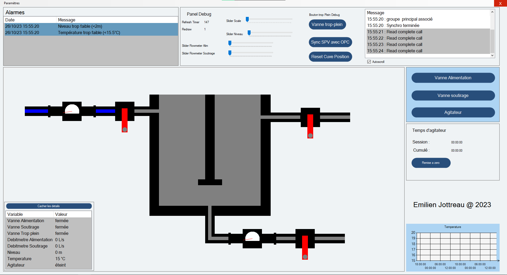

# Supervision d'une Cuve C#

Ce github contient les sources qui m'ont permis de faire ce projet ainsi qu'un compte rendu detaillant les fonctionalitées.

Le simulateur _"ClarificationBassinSimulation.exe"_ ne vient pas de moi, il a été fourni pas notre prof.

Apercu de l'interface

voici lien vers le
[Compte-Rendu](Compte-rendu%20Supervision.md)

Dedans on retouve un magnifique diagramme de classe UML, que j'ai fait grace a [yuml.me](https://yuml.me/), disponible dans ce fichier [source yuml](yuml.txt)

Cette supervision à été réalisée en C#, elle integre un client OPC DA, grâce à la librairie OPC Automation, la version de .NET utilisée est 4.8.